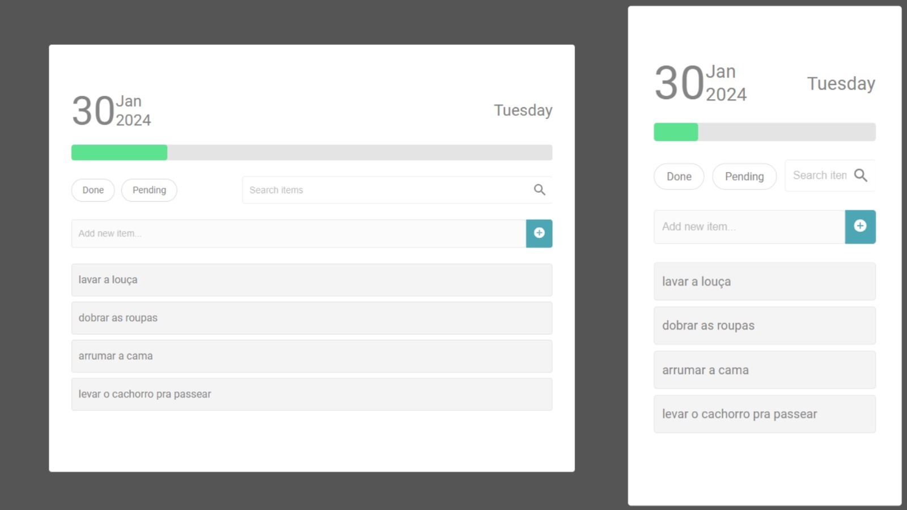

# Sizebay Project - Sizebay To-Do App

This project is a To-Do list application created with [Create Sizebay App](https://github.com/sizebay/create-szb-app).



## Table of Contents

- [About the Project](#about-the-project)
- [Features](#features)
- [Getting Started](#getting-started)
  - [Prerequisites](#prerequisites)
  - [Installation](#installation)
- [Available Scripts](#available-scripts)
  - [`yarn start`](#yarn-start)
  - [`yarn build`](#yarn-build)
- [Usage](#usage)
  - [Creating Tasks](#creating-tasks)
  - [Marking Tasks as Complete](#marking-tasks-as-complete)
  - [Removing Tasks](#removing-tasks)
  - [Filtering Tasks](#filtering-tasks)
- [Bug Reports](#bug-reports)
- [Learn More](#learn-more)

## About the Project

The Sizebay To-Do App is a task management application where users can create tasks, mark them as complete, or remove them. It also provides filtering options for pending and completed tasks.

## Features

- Create new tasks
- Mark tasks as complete
- Remove tasks
- Filter tasks by pending or completed status

## Getting Started

### Prerequisites

Before running the project, make sure you have the following tools installed in your environment:

- [Node.js](https://nodejs.org/) - Version 20.11.0

### Installation

Follow these steps to install and set up the project locally:

1. Clone the repository to your workspace:

   ```bash
   git clone https://github.com/sizebay/frontend-challenge.git
   ```

2. Join my branch
   ```bash
   git checkout mayoliveii:mayara/frontend-challenge
   ```

## Available Scripts

In the project directory, you can run:

### `npm install`

To install project dependencies, run the above command.

### `npm start`

Runs the app in the development mode.
Open [http://localhost:3000](http://localhost:3000) to view it in the browser.

The page will reload if you make edits.

### `npm build`

Builds the app for production to the `build` folder.
It correctly bundles React in production mode and optimizes the build for the best performance.

The build is minified, and the filenames include the hashes.

### `npm test`

Run the tests.

## Bug Reports

If you find any bugs, please report them on our [Issues page](https://github.com/sizebay/create-szb-app/issues).

## Learn More

- [Sizebay Website](https://sizebay.com/)
- [React Documentation](https://reactjs.org/)
